# Stocks

A crypto trading app for iOS — think Binance-lite. You browse live markets, dig into a coin's chart and order book, place orders, and keep an eye on your wallet. Built with UIKit (no storyboards, everything in code) and wired up to the OKX exchange for real market data.

Heads up: it's a personal project, so the money side is faked — no real backend, no real trading. Auth just flips a flag and your balance lives on-device. The *market data*, though, is the real deal, streamed live from OKX.

## What it does

- **Onboarding + sign-in** — a quick intro carousel, then a phone/email login (fake auth, but it remembers how you signed in).
- **Markets** — a live list of pairs from OKX, each with price, 24h change, and a sparkline. Prices tick in real time over a WebSocket.
- **Watchlist** — search the full list and star the pairs you care about.
- **Trade screen** — a proper candlestick chart with multiple intervals, a live order book, and buy/sell buttons that all update live.
- **Order entry** — place Market, Limit, or Stop-Limit orders. The form adapts to the type, and percentage shortcuts size the order against your balance so you can't overspend.
- **Orders** — open orders and history in one tab. Market fills instantly; Limit and Stop-Limit sit pending until you fill them, or swipe to cancel.
- **Wallet** — balance and holdings, a hide/show toggle, and a deposit sheet to top up.
- **Profile** — view and edit your profile.
- **Remote token icons** — coin logos are fetched by ticker and cached, so new coins get an icon automatically. Missing one falls back to a clean monogram instead of a blank circle.

## Screenshots

| Onboarding | Sign-in | Home | Markets |
|:---:|:---:|:---:|:---:|
| 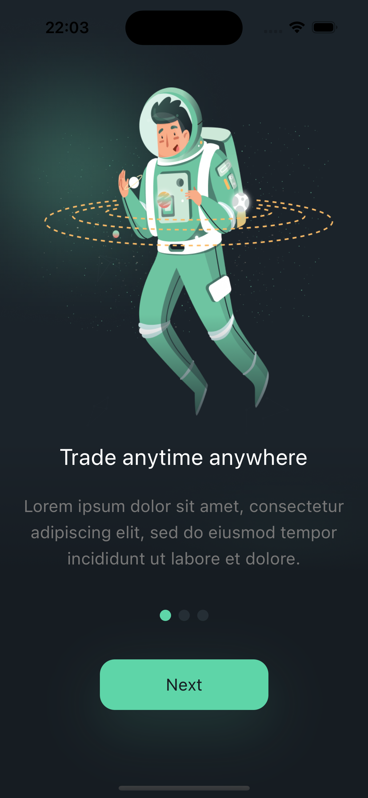 | 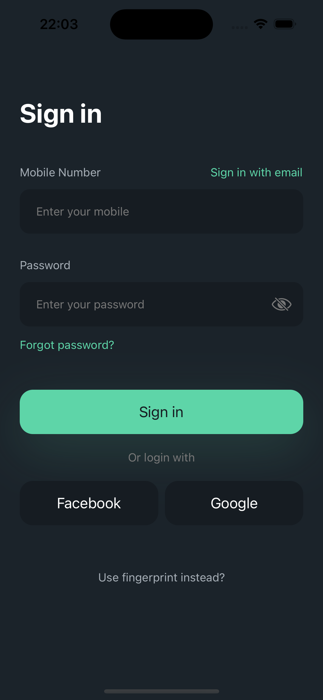 | 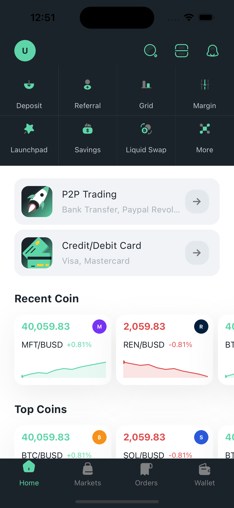 | 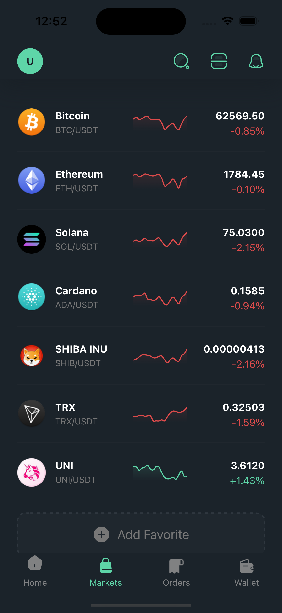 |

| Watchlist | Trade | Order entry | Orders |
|:---:|:---:|:---:|:---:|
| 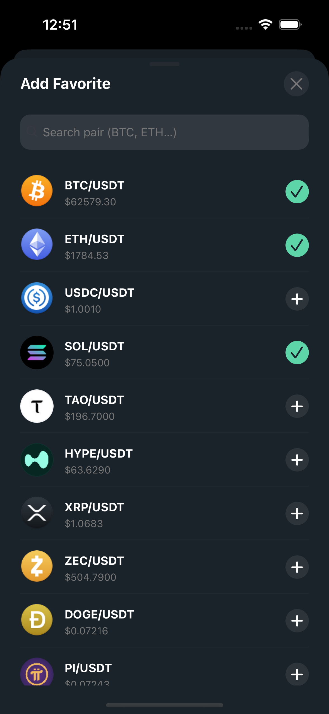 | 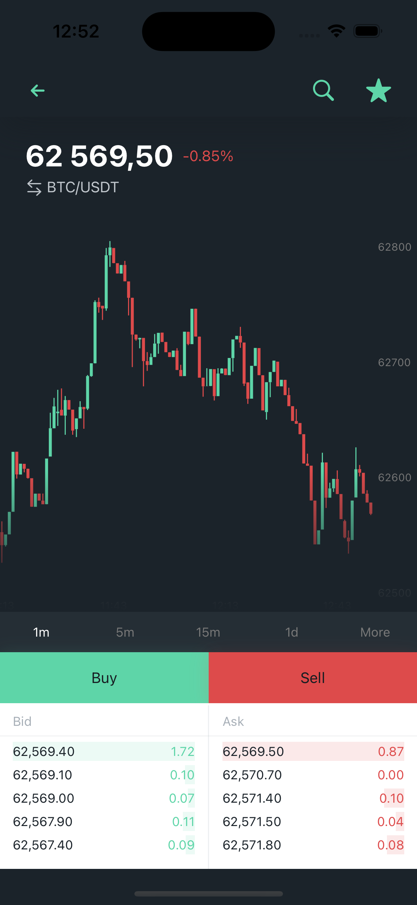 | 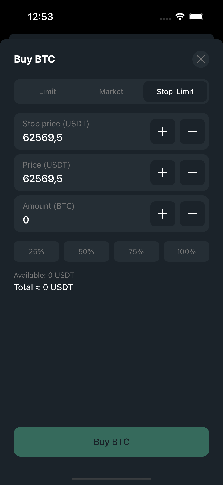 | 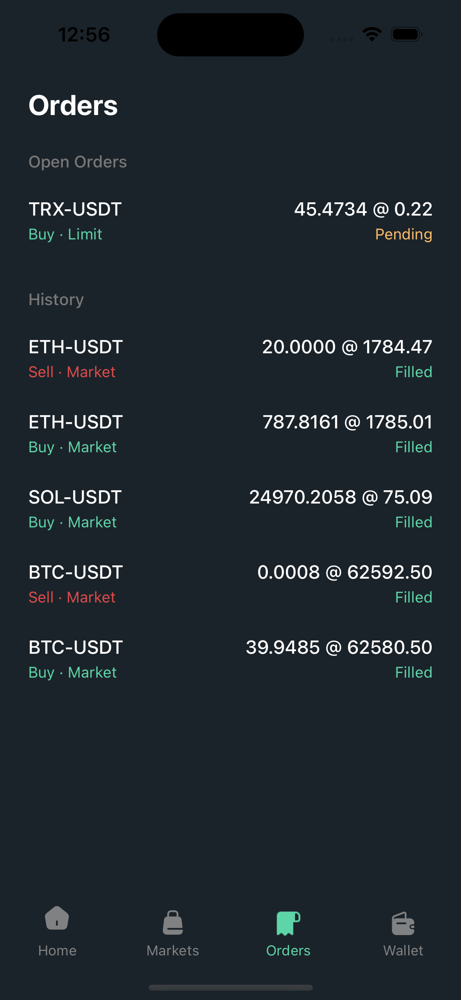 |

| Wallet | Profile | Coming soon |
|:---:|:---:|:---:|
| 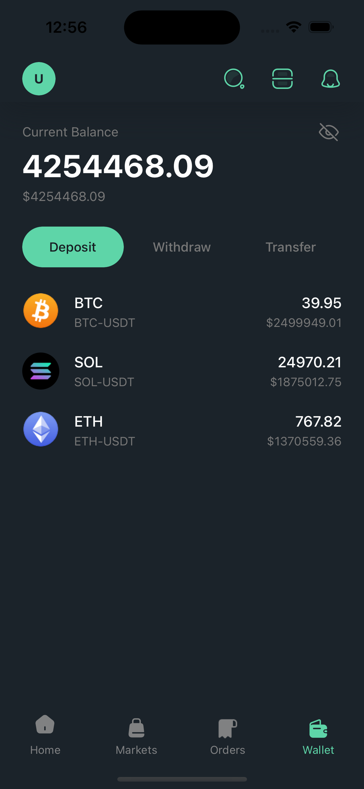 | 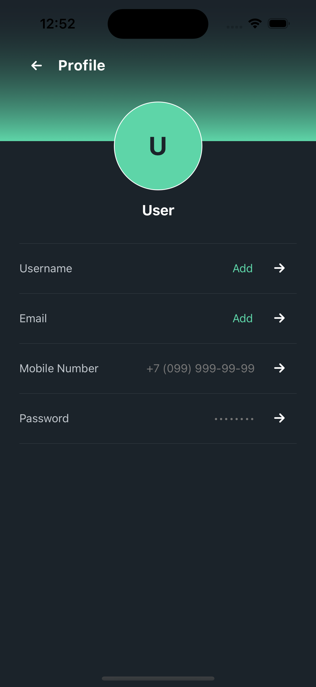 | 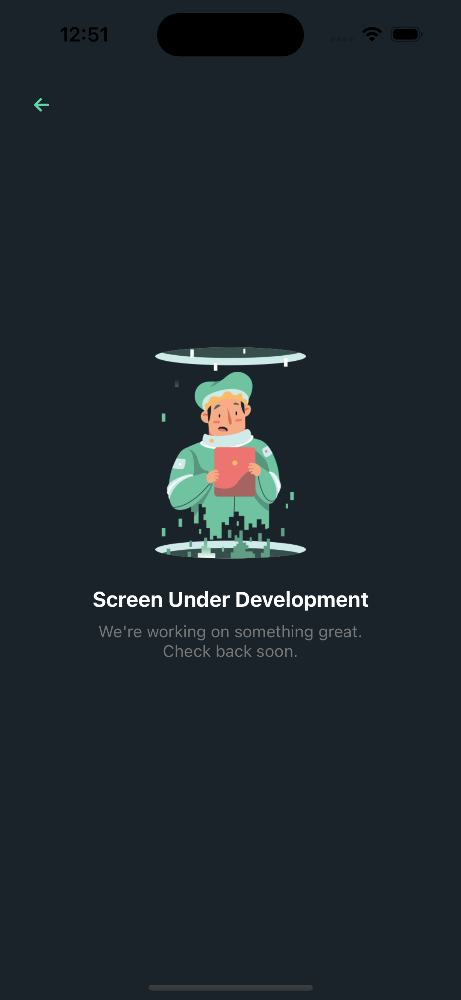 |

## Architecture

**Clean Architecture + MVVM + Coordinator**, loosely inspired by [kudoleh's iOS-Clean-Architecture-MVVM](https://github.com/kudoleh/iOS-Clean-Architecture-MVVM). Each layer stays in its lane:

- **Presentation** — ViewControllers + ViewModels. The VC draws the UI and binds; the ViewModel owns all state and logic. No networking or persistence in here.
- **Data** — DTOs, the REST/WebSocket services that talk to OKX, and the local storage wrappers. DTOs get mapped to domain models before they leave.
- **Core** — design tokens (colors, fonts, spacing) and reusable views.
- **Navigator** — the Coordinator and tab bar, the only place that pushes or presents screens. ViewControllers never navigate themselves — they fire a closure and let the Coordinator decide.

A few conventions throughout: every ViewModel is `@MainActor` and drives the UI through one `State` enum (`loading` / `loaded` / `error`); concurrency is all `async/await` and `Task`, no Combine or Rx; `weak self` in the closures that capture it.

```
stocks/
├── App/            AppDelegate, SceneDelegate
├── Core/           DesignSystem (tokens) + shared Components
├── Data/           Network (OKX REST/WebSocket, DTOs) + Persistence
├── Navigator/      MainCoordinator, TabBarController
├── Presentation/   Features: Home · Auth · Onboarding · Markets · Trades · Orders · Wallet · Profile
└── Resources/      Assets, fonts
```

## Tech stack

UIKit with programmatic layout, SnapKit for constraints, DGCharts for the charts, Starscream for the OKX WebSocket, and Swift Concurrency throughout. Local data lives in `UserDefaults`.

## Running it

Open `stocks.xcodeproj`, let Xcode resolve the packages, pick a simulator, and run. No API keys or setup needed — the OKX endpoints are public.


